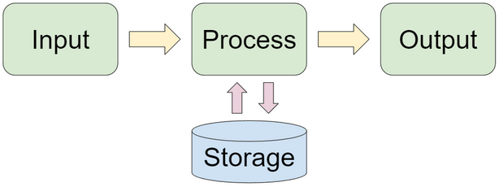
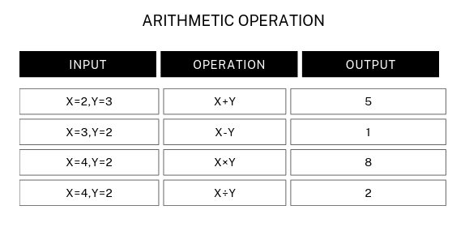
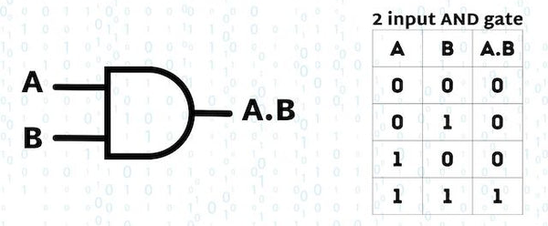
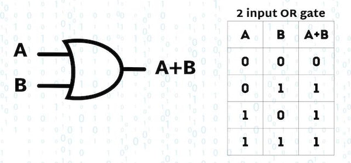
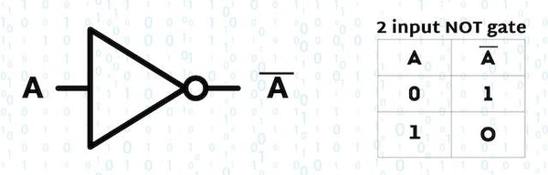
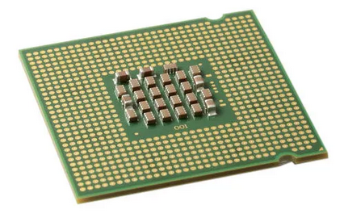
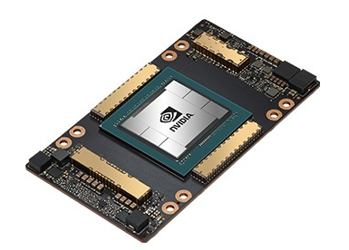

# COMPUTER

###### Question
+ Is computer is smart or intelligence machine ?
  
## Introduction 
+ A computer is an electronic machine use for computation.
+ Takes data as input, processes data as per instruction and without understanding the meaning of data gives output.
+ It use storage device to hold data, instruction and output during computation.
+ Historically, computer was the profession of people where people's job was to calculate and compute manually. And later computer were developed to for this task(compute) more faster.
  
#### Computation
+ A computer is computation machine not a calculation.
    + Computation → just follow instruction.
    + Calculatio  → Intution (use of brain).

+ In computation : A set of instruction (program) is written in computer to take the input perform operation and give output while performing this it store the data and computer just follow it.
  
   + **Input(Data)→ Processes(Operation) → Output(information)**
                        $\downarrow$
                         | **Storage** |
                           
                          
###### Answer
→ No computer is not smart or intelligence machine because it just follow the instrction (computation) which is given by us. Any thing is smart or intelligence if it's able to think and do with own instruciton but in computer we give a instruction just computer follow it without understanding so, it's "the dump machine" just following the instruciton faster.

________________________________________________________________________________________________

# Computer Cycle

###### Question
+ Is really computer can do multitasking ?

## IPOS
+ Computer follow IPOS cycle:
  
     
## Input
+ Data and istruction entered to computer.
+ Input device are use to input data.
    + Example of input device:
        + keyboard
        + mouse
        + microphone
## Output
+ Result which come after the processed data.
+ Output device are use to give reuslt.
    + Exaple of input device:
        + Monitor
        + Printer
        + Speaker
## Processing (Operation) 
+ Work on input data as instrction and give output.
+ Computer performs processing without understanding the actual meaning of the data.
+ Processing is the Operation.

### Operation
+ In basic there are two types of Operation:
    + ##### Arithmetic Operation 
    + ##### Logical Operation

#### Arithmetic Operation → (+,-,×,÷)
+ Basic Operation.
+ A set of instruction is written where a computer is instruct to perform a mathmatical calculation.
 
#### Logical Operation → (AND,OR,NOT)
+ Process of making decision by comparing data.
+ There is only two codition:
    + Ture(1)
    + False(0)
+ There types of logical operation:
     + ##### AND
          
     + ##### OR
        
     + ##### NOT
          
   
### Types of Processor : 
+ There are two types of Processor:
  
    + #### CPU (Central Processing Unit)
        + Used for the general purpose task.
        + CPU is optimize for series work.
        + It process data one by one.
        + less number of core
          
             
          
    + #### GPU (Graphical Processing Unit)
        + Used to perform heavy task.
        + GPU is optimize for parallel work.
        + It process data parallely.
        + High number of core
        
           
        
 ###### Answer
→ No computer is not multitasking machine, in deep down chip level computer do a one task at a    time just the speed of it's too fast so it seems performing multipile task.

________________________________________________________________________________________________

 ## Storage
 + 
 
